#   8086汇编语言程序设计

##  微机的功能结构

8086CPU由执行单元(EU)和总线接口单元(BIU)组成，从而形成指令流水

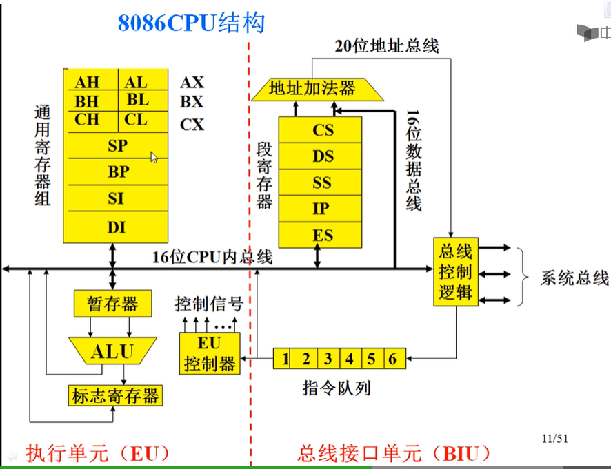

###  CPU寄存器

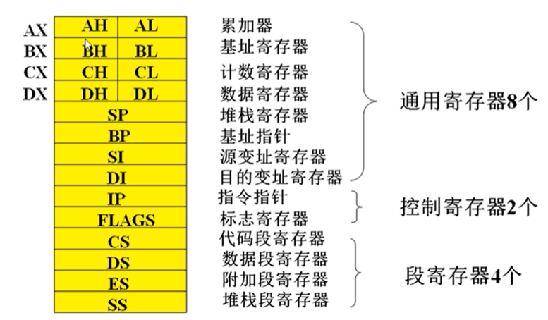

通用寄存器：数据寄存器，指针寄存器，变址寄存器

指令指针寄存器IP： CPU在从存储器取指令时，以段寄存器CS作为代码段的基址指针，以IP的内容作为偏移量，共同形成一条指令的存放地址。当CPU从内存中取出一条指令后，IP内容自动修改为指向下一条指令。

标志寄存器：是用来反映CPU在程序运行时的某些状态，如是否有进位、奇偶性、结果的符号、结果是否为零等等。

###  存储器的段结构

1. 8086/8088CPU将1MB的存储空间划分成若干个段，每个段最大长度为64K (65536)个字节单元组成。

2. 每个段的基址(段基址)必须是-一个小节的首址。

   段基址——一个段的起始位置。

   在存储器中规定从0地址开始，每16个字节单元称为一个小节(Paragraph)。因此，1MB内存就可划分为64K个小节。

   每个小节的首地址最低位必为0 ( 16进制数表示)因此段基址只能是上述64K个小节首址之一。

3. 逻辑段在物理存储器中可以是邻接的、间隔的、部分重叠的和完全重叠的等4种情况。

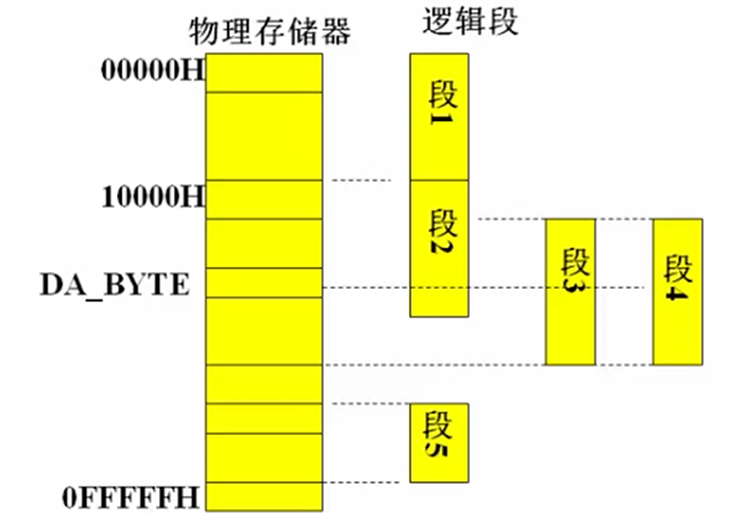

4.在任一时刻，一 个程序只能访问4个当前段中的内容。4个段分别是代码段、数据段、堆栈段和附加段，称为当前段。4个段寄存器CS、DS、SS和ES分别保存了它们段基址的高16位地址，称为 __段基值__ 。段基址的最低4位为0。(小节首址的低4位为全0)。

####  逻辑地址

逻辑地址的两个组成部分：段基址+偏移量

逻辑地址转物理地址方法：

由于段基址必须为一个小节的首地址，又因为一个小节的首地址(5位，物理地址)最低一位必为0，所以段基址取高四位。

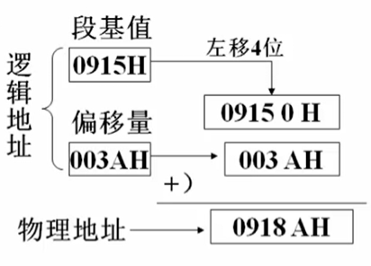

#####  逻辑地址的来源

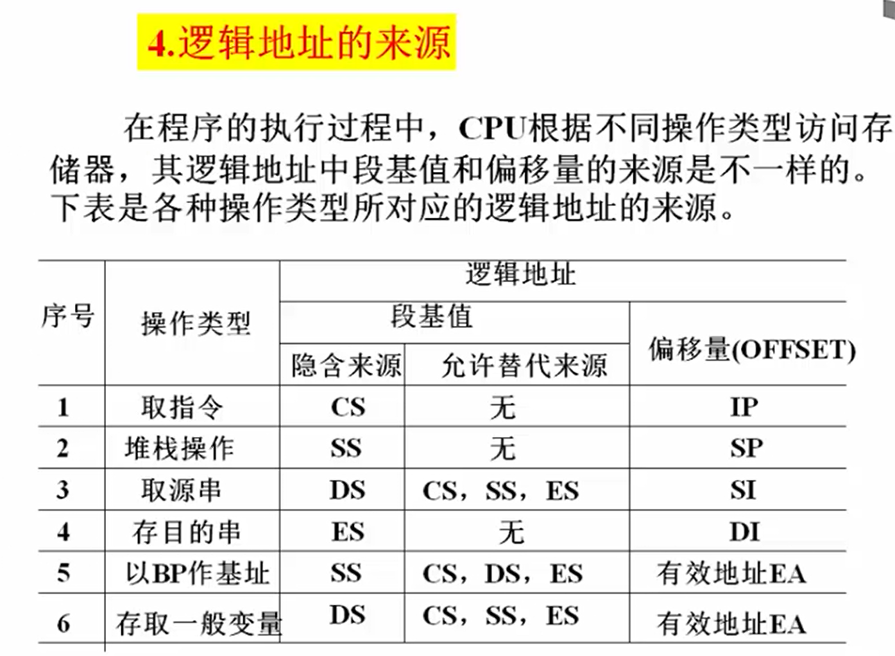

​			说明:
​			(1)允许替代来源也叫做 __段超越__ ，它表示了段基值除使用隐含的段寄存器外是否可以指定其它段寄存器来提供。

​			(2)有效地址EA，它表示根据指令所采用的寻址方式计算出来的段内偏移量。

###  堆栈及其操作方法

堆栈是一个特定的存储区，访问该存储区一般需要按照专门的规则进行操作。

> 堆栈的用途:主要用于暂存数据以及在过程调用或处理中断时保存断点信息。

堆栈指针(SP)指向堆栈Top

顶由堆栈指针SP指示。SP中内容始终表示堆栈段基址与栈顶之间的距离(字节数)。当SP内容为最大(初始)值时，表示堆栈为空。而当(SP) =0时,表示堆栈全满.

当SP被初始化时， __指向栈底+2单元__ ，其值就是堆栈的长度。由于SP是16位寄存器，因此 __堆栈长度≤64K__ 字节。
数据在堆栈中的存放格式是: __以字为单位__ 存放，数据的低8位放在较低地址单元，高8位放在较高地址单元。

当用户程序中要求的堆栈长度超过一个堆栈段的最大长度64KB时，可以设置几个堆栈段。通过改变堆栈段寄存器SS的内容，即可改变到另一个堆栈段，当改变了堆栈段寄存器SS的内容后，必须紧接着赋予SP新值。

##  寻址方式和指令系统

###  寻址方式

这里简单的举一些例子，更详细的参照组成原理

Intel8086/8088各指令中提供操作数的方法有以下四种:

* 立即数操作数——操作数在指令代码中提供
* 寄存器操作数——操作数在CPU的通用寄存器或段寄存器中
* 存储器操作数——操作数在内存的存储单元中
* I/O端口操作数——操作数在输入/输出接口的寄存器中

####  操作数寻址方式

1. 立即数寻址

   将20H送到AH中

   ```assembly
   MOV AH, 20H
   ```

2. 寄存器寻址

   ```assembly
   MOV AX, BX
   MOV DS, AX
   ```

3. 直接寻址

   在直接寻址方式的指令中，操作数的有效地址EA只有位移量地址分量。

   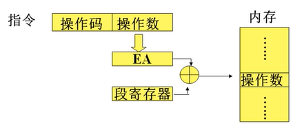

   直接寻址方式用符号或常数表示

   ```assembly
   MOV BX, VAR
   MOV AL, DATA+2
   MOV AX, DS:[64H]
   ```

   

4. 寄存器间接寻址

   操作数有效地址EA直接从基址寄存器(BX或BP)或变址寄存器(SI或DI)中获得。

   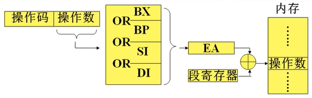

   隐含规则：

   指示存储器所在段的段寄存器可以省略，当指令中使用的是BP寄存器，则隐含表示使用SS段寄存器，其余情况则隐含使用DS段寄存器。

   ```assembly
   MOV AX, [BX]
   MOV BH, [BP]
   MOV [DI], BX
   ```

   

5. 基址寻址

   操作数的有效地址EA等于基址分量或变址分量加上指令中给出的位移量。

   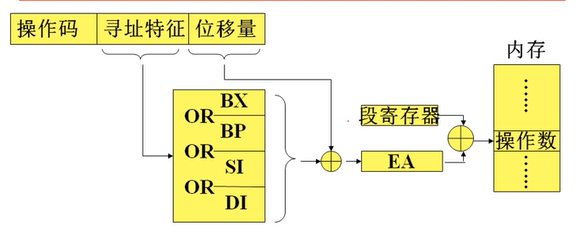

   ```assembly
   MOV AX, 10H[SI]
   MOV AX, [SI+10H]
   MOV AX, [SI].10H
   MOV TABLE[DI], AL
   ```

   

6. 基址变址寻址

   操作数的有效地址是三个地址分量之和：
   $$
   EA = 基址 +变址+位移量
   $$
   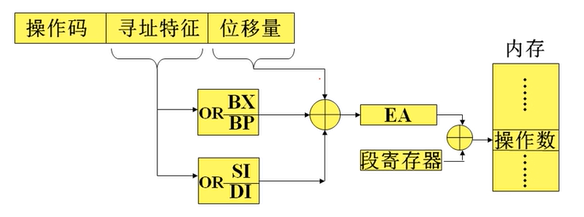

   当基址选用BX时隐含使用段寄存器DS，而选用BP时则隐含使用段寄存器SS。

   ```assembly
   MOV CX, 100H[BX][DI]
   MOV TABLE[BX][DI], AX
   ```

####  串寻址方式

8086/8088设置有专门用于串操作的指令，这些指令的操作数虽然也在存储器中，但它们不使用前面介绍的各种寻址方式，而隐含地使用变址寄存器SI和DI专门指示。

* 在寻找源操作数时，隐含使用SI作为地址指针。在寻找目的串时，隐含使用DI作为地址指针。
* 在串操作完成之后，自动对SI和DI进行修改，使它们指向下一个操作数。

#### I/O端口寻址方式

8086/8088系统中就是采用I/O端口编址方法。I/O端口的地址与存储器地址分开，并使用专门的输入指令
输出指令。可以最多访问64K个字节端口或32K个字端口，用专门的IN指令和OUT指令访问。

寻址方式有如下两种：

1. 直接端口寻址

   直接端口寻址可访问的端口数为0~255个

   ```assembly
   IN AL, 25H
   ```

2. 寄存器间接端口寻址

   寄存器间接端口寻址:把I/O端口的地址先送到DX中，用DX作间接寻址寄存器。

   ```assembly
   MOV DX, 328H
   OUT DX, AL
   ```

   

   如果访问的端口地址值大于255，则必须用I/O端口的间


###  指令系统

Intel8086/8088CPU指令系统的指令可以分为六大类:

1. 传送类指令
2. 算术运算类指令
3. 位操作类指令
4. 串操作类指令
5. 程序转移类指令
6. 处理器控制类指令

从指令的格式划分，一般可以分为三种:
1. 双操作数指令: OPR DEST SRC
2. 单操作数指令: OPR DEST
3. 无操作数指令: OPR

####   传送类指令

#####  通用数据传送指令

```assembly
MOV DEST, SRC
```

`MOV` 指令对标志寄存器各位无影响

段寄存器只能做源操作数，不能做目的操作数

综合起来，MOV指令在使用时需注意以下几个问题:

1. 立即数只能作源操作数，且它不能传送给段寄存器。
2. 段寄存器CS只能作源操作数，段寄存器之间不能直接传送。
3. 存储单元之间不能直接传送数据
4. MOV指令不影响标志位

#####  交换指令

```assembly
XCHG DEST, SRC
```

`XCHG` 指令对标志寄存器各位无影响

数据交换可以在寄存器之间或寄存器与存储器单元之间进行。但是不能在存储单元之间直接进行数据交换。寄存器只能使用通用寄存器。

#####   标志传送指令

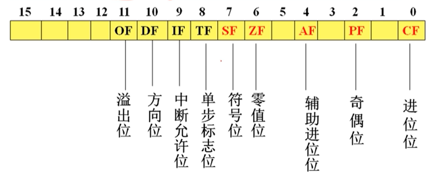

对标志寄存器进行存取的指令有4条，它们都是无操作数指令，即指令隐含指定标志寄存器、AH寄存器或堆栈为操作数。

1. 取标志寄存器指令

   ```assembly
   LAHF
   ```

   作用:将标志寄存器的低8位送入AH寄存器，即将标志SF、ZF、AF、PF和CF分别送入AH的第		7、6、4、2、0位，而AH的第5、3、1位 __不确定__ 。
   
2. 存储标志寄存器指令

   ```assembly
   SAHF
   ```

   作用:将寄存器AH中的第7、6、4、2、0位分别送入标志寄存器的SF、ZF、AF、PF和CF各标志位。而标志寄存器高8位中的各标志位不受影响。
   
3. 标志进栈指令
   
      ```assembly
      PUSHF
      ```
      
      作用:先将堆栈指针SP减2，使其指向堆栈顶部的空字单元，然后将16位标志寄存器的内容送SP指向的字单元。

4. 标志出栈指令

   ```assembly
   POPF
   ```

   作用:将由SP指向的堆栈顶部的-一个字单元的内容送入标志寄存器，然后SP的内容加2.

######  地址传送指令

1. 装入有效地址

   ```assembly
   LEA DEST, SRC
   ```

   指令对标志寄存器各位无影响

   其中:源操作数SRC必须是一个字节或字存储器操作数(地址)，DEST必须是一个16位通用寄存器。

   作用:将SRC存储单元地址中的偏移量，即有效地址EA传送到一个16位通用寄存器中。

2. 装入地址指针指令

   ```assembly
   LDS DEST, SRC
   LES DEST, SRC
   ```

   其中:DEST是任意一个16位通用寄存器。SRC必须是一个存储器操作数。
   作用:把SRC存储单元开始的4个字节单元的内容(32位地址指针)送入DEST通用寄存器和段寄存器DS (LDS指令)或ES (LES指令)，其中低字单元内容为偏移量送通用寄存器，高字单元内容为段基值送DS或ES。

####   算数运算指令

#####  加法指令

```assembly
ADD DEST, SRC 
```

根据相加的结果将影响到标志寄存器的CF、PF、AF、ZF、SF和OF
DEST只能是通用寄存器或存储器操作数。不能是立即数。
SRC可以是通用寄存器、存储器或立即数操作数
DEST和SRC不能都为存储器操作数。

#####   进位加法指令

```assembly
ADC DEST, SRC
# DEST <= (DEST) + (SRC) + CF
```

用ADC可以实现大于16位的数的相加

#####  加1指令

``` assembly
INC DEST
```

#####   减法指令

```assembly
SUB DEST, SRC
DEST <= (DEST) - (SRC)
```

目的操作数DEST和源操作数SRC可以是8位或16位的通用寄存器、存储器操作数，但两者不能同时为存储器操作数。立即数只能作源操作数。

#####  带借位减法

```assembly
SBB DEST, SRC
# DEST <= (DEST) -（SRC) - CF
```

#####  减一指令

```assembly
DES DEST
```

#####  求负数指令

```assembly
NEG DEST
# DEST <= 0-(DEST)
```

也叫取补指令

####  位操作类指令

```assembly
AND DEST, SRC
OR DEST, SRC
XOR DEST, SRC
NOT DEST
```

#####   测试指令

```assembly
TEST DEST, SRC
```

该指令的功能与AND指令相似，实现源操作数与目的操作数进行按位"逻辑与”运算，对标志位的影响与AND指令相同，但运算的结果不送入目的操作数，即 __目的操作数内容也将保持不变__。

#####  移位/循环移位指令

共8条，3类

######   算数移位

```assembly
SAL DEST, COUNT #算数左移
SAR DEST, COUNT #算术右移
```

######   逻辑移位

```assembly
SHL DEST, COUNT #逻辑左移
SHR DEST, COUNT #逻辑右移
```

######   循环移位

1. 小循环

   ```assembly
   ROL DEST, COUNT #循环左移
   ROR DEST, COUNT #循环右移
   ```

   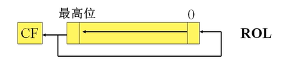

2. 大循环

   ```assembly
   RCL DEST, COUNT #带进位循环左移
   RCR DEST, COUNT #带进位循环右移
   ```

   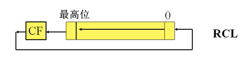

`COUNT` 决定移位次数，当移位次数为1时，使用常数1或寄存器CL。当移位次数大于1时，必须使用寄存器CL。

前4条移位指令根据移位结束后修改标志位CF、PF、ZF、SF和OF，而AF不确定。而后4条循环移位指令根据移位结束后的结果仅修改CF和OF

对溢出标志位OF的影响: 移位次数为1时，移位前后操作数的符号位发生变化，则OF被置1，否则置0。移位次数太于1时，OF不确定

对于多字节或多字数据的移位，需要使用带进位循环移位指令。

####  处理器控制类指令

#####  标志位操作指令

它们都是无操作数指令，操作数隐含为标志寄存器的某个标志位。能直接操作的标志位有CF, IF和DF。

1. 清除进位标志

   ```assembly
   CLC
   ```

2. 置1进位标志

   ```assembly
   STC
   ```

3. 进位标志取反

   ```assembly
   CMC
   ```

4. 清除方向标志

   ```assembly
   CLD
   ```
   
5. 置1方向标志

   ```assembly
   STD
   ```

6. 清除中断标志

   ```assembly
   CLI
   ```
   
7. 置1中断标志

   ```assembly
   STI
   ```
   
#####  与外部事件同步指令
```assembly
HLT  #暂停指令
WAIT # 等待指令
ESC  # 外部协处理器指令前缀
LOCK # 总线锁定指令
```

#####  空操作指令

```assembly
NOP
```

执行一次NOP占用CPU三个时钟周期，它不改变任何寄存器或存储单元内容，主要用于延时。

###   编码格式

Intel8086/8088汇编指令的编码格式有四种基本格式。

1. 双操作数指令编码格式
2. 单操作数指令编码格式
3. 与AX或AL有关的指令编码格式
4. 其它 指令编码格式

##  一些东西

###  loop

CPU执行loop时做两件事：

1. (cx) = (cx) - 1;
2. 判断cx中的值，如果不为零继续循环，为零跳出循环

也就是说cx存放循环次数

###  段操作

``` assembly
assume cs:codesg, ds:datasg, ss:stacksg

datasg segment
    dw 0123h,0456h,0789h,0abch
datasg ends

stacksg segment
    dw 0,0,0,0,0,0,0,0
stacksg ends

codesg segment
start:
    mov ax, stacksg 
    mov ss, ax  
    mov sp, 10h

    mov ax, datasg  
    mov ds, ax

    mov bx, 0
    mov cx,4 
s:  push ds:[bx]
    add bx, 2
    loop s

    mov bx, 0
    mov cx, 4
s0: pop ds:[bx]
    add bx, 2
    loop s0
    
    mov ax, 4c00h
    int 21h

codesg  ends

end start
```

###  字符串大小写转换

```assembly
assume cs:codesg, ds:datasg

datasg segment
    db "Xing"
    db "zhiAng"
datasg ends

codesg segment
start:
    mov ax, datasg
    mov ds, ax
    mov bx, 0
    mov cx, 4
# 转大写
s:  mov al, ds:[bx]
    and al, 11011111b
    mov ds:[bx], al
    inc bx
    loop s

# 转小写
    mov bx, 4
    mov cx, 6
s0: mov al, ds:[bx]
    or al, 00100000b
    mov ds:[bx], al
    inc bx
    loop s0

    mov ax, 4c00h
    int 21h
codesg ends

end start
```

###  SI和DI

源地址和目的地址寄存器

将一段字符拷贝一份

```assembly
assume cs:codesg, ds:datasg

datasg segment
    db "XingZhiang"
    db ".........."
datasg ends

codesg segment
start:
    mov ax, datasg
    mov ds, ax
    mov si, 0
    mov di, 10
    mov cx, 5
s:  mov ax, ds:[si]
    mov ds:[di], ax
    add si, 2
    add di, 2
    loop s

    mov ax, 4c00h
    int 21h
codesg ends

end start
```

###   数据宽度指定

引进X ptr操作符指明内存长度，示例如下：

```assembly
# 指定立即数宽度为一个字(16位)
mov word ptr ds:[0], 1
# 低字节加1
inc byte ptr [bx]
```

注意 __push__ 和 __pop__  总是1个字

###   div指令

div是除法指令，使用div做除法要注意一下问题:

1. 除数:有8位和16位两种，在一个reg或内存单元中。
2. 被除数:默认放在ax或dx和ax中存放，dx存放高16位，ax放低16位。
3. 结果:如果除数为8位，则al存储除法操作的商，ah存储余数;  如果除数为16位，则ax存储除法操作的商，dx存储除法操作的余数。

```assembly
div byte ptr ds:[0]
# (al) = (ax) / ((ds)*16 + 0)的商
# (ah) = (ax) / ((ds)*16 + 0)的余数

div word ptr es:[0]
# (ax) = ((dx)*10000H + (ax)) / ((es)*16 + 0)的商
# (bx) = ((dx)*10000H + (ax)) / ((es)*16 + 0)的余数
```

###   转移指令

*  jump

  1. 段内短转移和近转移

     ```assembly
     jmp short 标号 (IP) = (IP) + 8位
     jmp near ptr 标号 (IP) = (IP) + 16位
     ```

  2. 段间转移

     ```assembly
     jmp far ptr 标号 
     jmp dword ptr #高地址是段地址，低地址是偏移地址
     ```

* jcxz指令

  条件转移指令

  所有条件转移指令均为短转移，所以机器码中包含的是位移，而不是目的地址ip转移范围-128~127

  操作：当(cx)=0时跳，负责不跳

####   练习

将屏幕中间置字符,效果如下

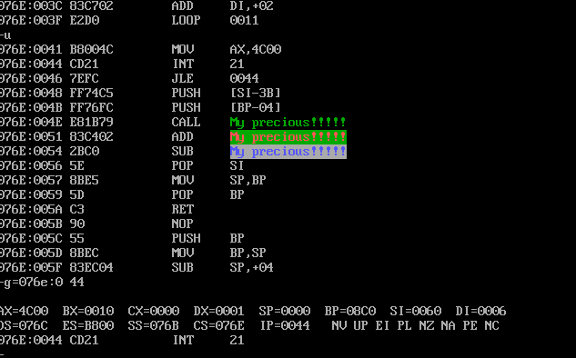

```assembly
assume cs:codesg, ds:datasg

datasg segment
    dw 1920,2080,2240,64
    db "My precious!!!!!"
    db 82h,0ach,0f9h
datasg ends

codesg segment
start:
    mov ax, datasg
    mov ds, ax

    mov ax, 0B800h
    mov es, ax

    mov cx, 3
    xor di, di
    xor si, si
s1: mov ax, di
    mov bl, 2
    div bl
    mov si, ax
    mov ah, [si+24]

    mov si, ds:[6]
    mov bp, [di]

    mov dx, cx
    mov bx, 0

    mov cx, 16
s2: mov al, [bx+8]
    mov es:[bp+si], al
    mov es:[bp+si+1], ah
    inc bx
    add si, 2
    loop s2

    mov cx, dx
    add di, 2
    loop s1


    mov ax, 4c00h
    int 21h
codesg ends

end start
```

###  ret和retf

* ret是转移指令，用栈中的数据，修改IP的内容，从而实现近转移

  本质：

  (IP) = ((SS)*16 + (SP))

  (SP) = (SP) + 2	

* retf是转移指令，用栈中的数据，修改CS和IP的内容，从而实现远转移

  本质：

  (IP) = ((SS)*16 + (SP))

  (SP) = (SP) + 2	

  (CS) = ((SS)*16 + (SP))

  (SP) = (SP) + 2

###  call

call指令功能：

1. 将当前的IP或CS和IP压入栈中
2. 转移

####  基本使用形式

```assembly
call 标号
# (sp) = (sp) - 2
# ((ss)*16 +(sp)) = (ip)
# (ip) = (ip) + 16位位移
call far ptr 标号
# (sp) = (sp) - 2
# ((ss)*16 +(sp)) = (cs)
# (sp) = (sp) - 2
# ((ss)*16 +(sp)) = (ip)
# (cs) = 标号所在段的段地址
# (ip) = 标号所在段的偏移地址
call ax
# (sp) = (sp) - 2
# ((ss)*16 +(sp)) = (ip)
# (ip) = (ax)
call word ptr 内存单元地址
# push ip
# jmp word ptr 内存单元地址
call dword ptr 内存单元地址
# push cs
# push ip
# jmp word ptr 内存单元地址
```

###  mul指令

1. 两个相乘的数:要么都是8位，要么都是16位。如果是8位，一个默认放在al中，另一个放在8位reg或内存字节单元中;如果是16位，一个在AX中，另一个在16位reg或内存字单元中。
2. 结果:如果是8位乘法，结果默认放在ax中;如果是16位乘法，结果高位默认在dx中存放，低位在ax中存放。

格式：

```assembly
mul reg
mul mem
mul byte ptr ds:[0]
```

###  函数

```assembly
assume  cs:codesg 
codesg segment
	mov cx, 3
s:	mov ax, 1
	call dadd
    loop s
   
dadd:add ax, ax
	ret
codesg ends
end
```

