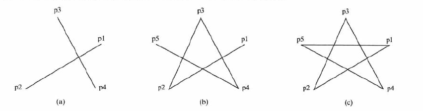
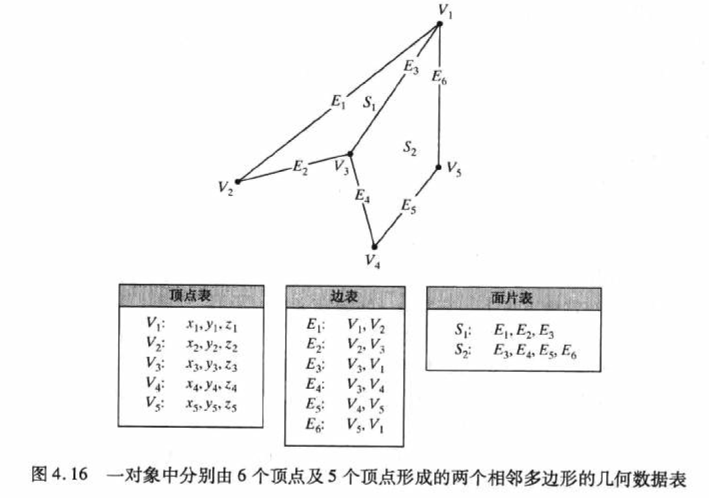
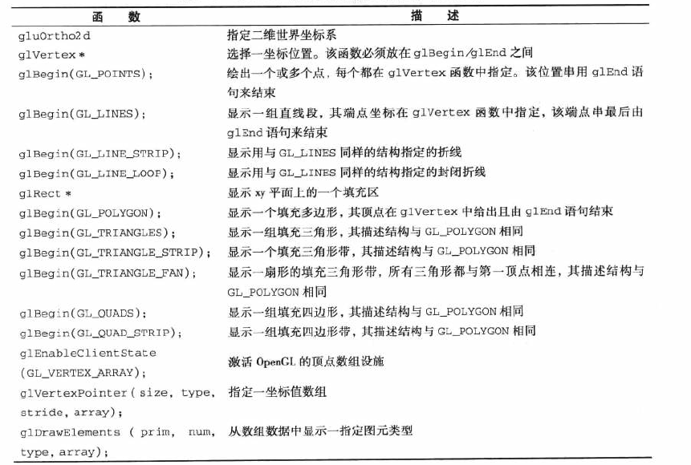
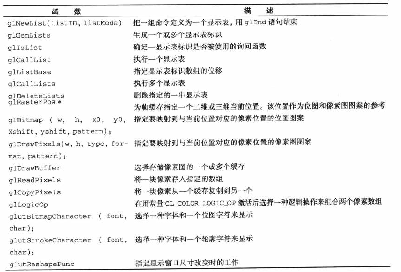
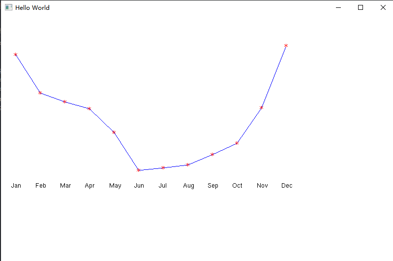
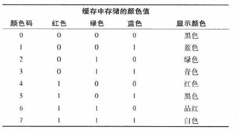
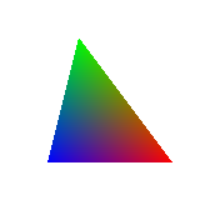
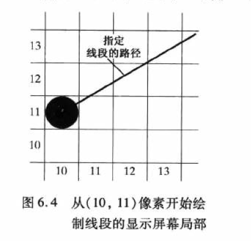
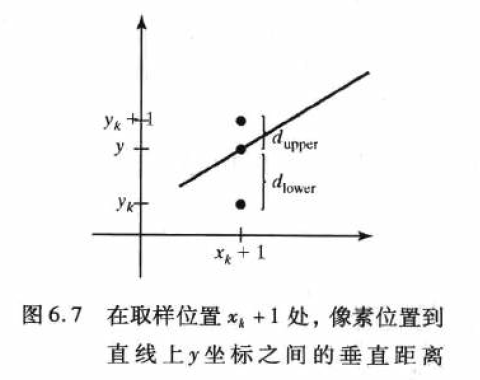

#  计算机图形学

##  基本概念

* __图元__ ： 图形的基本构造快称为图形输出图元。它们包括字符串和几何成分。

* __属性__： 输出图元的特性。包括颜色设定、线型或文本格式及区域填充图案等。

* __几何变换__:：改变场景中一个对象的大小、位置或方向

* __建模变换__： 将建模坐标系中给出的对象描述组织成场景。

* __观察变换__：用来指定将要显示的视图、使用的投影类型及在输出显示区域出现的范围。

* __输出函数__：用于控制和处理来自这些交互设备的数据流。

* __操作控制__：图形软件包常常包含许多事务性任务，如将显示屏变成指定颜色及对参数进行初始化。我们将这类处理事务性任务的功能归入控制操作类。

## OpenGL

 ###  基本的OpenGL语法

* 函数名以 gl 为前缀，每一个组成词的第一个字母要大写

  ```C++
  glBegin   glClear    glCopyPixels
  ```

* 常量以GL开头，每一组成词均大写，用下划线分开

  ```C++
  GL_RGB
  ```

* 内置数据类型

  ```C++
  GLbyte GLshort
  ```

###  相关库

* OpenGL实用函数：GLU
* OpenGL实用函数工具包(GLUT):提供了与任意窗口交互的函数库

###  第一个OpenGL程序

```C++
#define NDEBUG
#include <GL/glut.h>

void init(void) {
	glClearColor(1.0, 1.0, 1.0, 0.0);

	// 设置投影参数
	glMatrixMode(GL_PROJECTION);
	// 其他观察参数
	gluOrtho2D(0.0, 200.0, 0.0, 150.0);
}

void lineSegment(void) {
	// 将颜色赋值在窗口上显示
	glClear(GL_COLOR_BUFFER_BIT);

	glColor3f(0.0, 0.4, 0.2);
	glBegin(GL_LINES);
	glVertex2i(180, 15);
	glVertex2i(10, 145);
	glEnd();
    
    // glFlush()用于强制刷新缓冲，保证绘图命令将被执行，而不是存储在缓冲区中等待其他的OpenGL命令
	glFlush();

}

void main(int argc,char **argv) {
	// 初始化GLUT
	glutInit(&argc, argv);
	glutInitDisplayMode(GLUT_SINGLE | GLUT_RGB);
	// 设置窗口位置
	glutInitWindowPosition(50, 100);
	// 设置窗口尺寸
	glutInitWindowSize(400, 300);
	// 创建窗口
	glutCreateWindow("Hello World");

	init();
    //  将图元赋予显示窗口
	glutDisplayFunc(lineSegment);
	glutMainLoop();

}
```

##  输出图元

###  坐标系统

为了描述图形，必须有一个称为世界坐标系的合适的二维或三维笛卡尔坐标系。

对于三维图形，坐标范围也称对象的包围盒。

对于二维图形，坐标范围也称对象的包围矩形。

#### 屏幕坐标

屏幕上的位置使用与帧缓存中像素位置相对应的整数__屏幕坐标__进行描述。

像素坐标值给出扫描行号( $ y $ 值)和列号( $ x $ 值)。

从屏幕最上面的0行到最下面的某整数值 $ y_{max} $ 行。从左到右，从0到 $ x_{max} $ 进行编号。

但是，使用软件命令可以按照任何方式设定屏幕坐标系，例如，设置左下角为原点，用整数坐标系或非笛卡尔坐标系描述图形。

三维坐标系中，屏幕坐标用三维值存储，第三维数据表示对象位置相对于观察位置的__深度__，在二维场景中深度均为0.

#### 绝对和相对坐标

以上我们讨论的都是绝对坐标

有些图形软件允许使用__相对坐标__来描述位置。使用这一方法我们可以从离开最后一次引用的位置(称为__当前位置__) 的位移量来指定坐标位置。

>如位置 $ \left(3,8\right) $ 是应用程序刚刚引用的位置，则相对坐标描述 $ \left(2,-1\right) $ 和绝对坐标 $ \left(5,7\right) $ 相对应。

###  OpenGL中指定二维世界坐标系统

我们可以用`gluOrtho2D`命令设定一个二维笛卡尔坐标系，该函数的变量指定图形的 $ x $ 和 $ y $ 坐标范围。我们可以用下列语句定义屏幕显示窗口的坐标系统：

```C++
glMatrixMode(GL_PROJECTION);
glLoadIdentity();
gluOrtho2D(xmin,xmax,ymin,ymax);
```


<center>函数指定的显示窗口的世界范围</center>

###  OpenGL画点函数

要描述一个点的几何要素，我们只需在世界坐标系中指定一个位置。除非指定其他属性值，OpenGL图元按默认的大小和颜色来显示。默认图元颜色为__白色__，默认的点大小为单一屏幕像素。

使用下面函数指定一个点的位置

```C++
glVertex* ()
```

(*)表示该函数要后缀码，用于指明空间维数、坐标值变量的数据类型和可能的向量形式坐标描述。glBegin( )函数的变量用于指定有显示图元的类型，而glEnd( ) 函数没有变量。

对于点的绘制，glBegin( ) 函数的变量为__GL_POINTS__,因此，一个点的位置的OpenGL描述形式是：

```C++
glBegin(GL_POINTS);
	glVertex* ( );
glEnd();
```

* `glVerTex`的第一个后缀代表其坐标维度

* `glVerTex`的第二个后缀代表其数值描述使用的数据结构

  >  $ i(整数),s(短整数),f(浮点数),d(双精度浮点数) $ 

* 如果用矩阵形式坐标位置，则需要第三个后缀码： $ v("向量") $ 

画点的几种形式

```C++
// 第一种形式
glBegin(GL_POINTS);
	glVertex2i(180, 15);
	glVertex2i(10, 145);
glEnd();

// 第二种形式
int point1[] = { 180,15 };
int point2[] = { 10,145 };

glBegin(GL_POINTS);
	glVertex2iv(point1);
	glVertex2iv(point2);
glEnd();

// 第三种形式
class wcPT2D {
    public:
    	GLfloat x,y;
};

wcPT2D pointPos;

pointPos.x = 120.75;
pointPos.y = 45.30;
glBegin(GL_POINTS);
	glVertex2f(pointPos.x,pointPos.y);
glEnd();
```


###  OpenGL画线函数

OpenGL画线函数的有三种图元参数，分别为：`GL_LINES`直线，`GL_LINE_STRIP`折线，`GL_LINE_LOOP`封闭折线，三种形式代码分别如下。

```C++
// 直线(a)glBegin(GL_LINES);	glVertex2iv(p1);	glVertex2iv(p2);	glVertex2iv(p3);	glVertex2iv(p4);	glVertex2iv(p5);glEnd();// 折线(b)glBegin(GL_LINE_STRIP);	glVertex2iv(p1);	glVertex2iv(p2);	glVertex2iv(p3);	glVertex2iv(p4);	glVertex2iv(p5);glEnd();// 封闭折线(c)glBegin(GL_LINE_LOOP);	glVertex2iv(p1);	glVertex2iv(p2);	glVertex2iv(p3);	glVertex2iv(p4);	glVertex2iv(p5);glEnd();
```

生成线条如下：



###  填充区图元

除了点、直线段、曲线外，另外一种有用的描述图形组成部分的结构是使用某种颜色或图案进行填充的区域。这种类型的图形部分一般称为__填充区__

图形库一般不支持任意填充形状的描述。多数库函数要求填充区域指定为多边形

###  内外测试

鉴别对象的内外区域

* __奇偶规则__: 从任意位置 $ P $ 到对象坐标范围以外的远点画一条概念上的直线(不过多边形顶点)，统计延该直线与各边的交点数目。若与这条直线相交的多边形边数为奇数，则 $ P $ 是内部点，否则是外部点。

* __非零环绕数__: 非零就是路径包围的区域任意点 $ P $ 向外做一条射线，环绕数为0，如果相交的边是从左向右环绕数减1，从右向左环绕数加1，环绕数不为零 $ P $ 为内部点，反之为外部点 。

  > 一种确定有向边界穿越的方法是延对象边建立向量，将从 $ P $ 点出发的射线向量 $ \vec{u} $ 与穿过射线的每条边向量 $ \vec{E} $ 进行叉积运算。如果对于某特定边，叉积 $ \vec{u}\times\vec{E} $ 的 $ z $ 分量为正，那么边从右向左环绕数加1，反之环绕数减1。

注意：非零环绕规则将有些区域定义为內部，而奇偶规则将其定义为外部

###  多边形表

多边形数据表分成两组：几何数据表和属性数据表

场景中对象的几何数据简单组织成三张表：顶点表、边表和面片表

> 面片表 $ \rightarrow $ 边表 $ \rightarrow $ 顶点表( $ \rightarrow $ 表示指针)



###  OpenGL像素阵列函数

####  OpenGL位图函数

下面函数定义一个二值的阵列：

``` C++
glBitmap(width, height, x0, y0, xOffset, yOffset, bitShape);// width, height 给出了阵列bitShape和行数和列数。// bitShape的每一个像素赋值为1或0.1表示像素用当前设定的颜射显示// x0,y0 定义矩形阵列原点的位置// xOffset,yOffset坐标位移// 使用下面子函数来设定光栅当前位置glRasterPos*();// 完整例子如下：GLubyte bitShape[20] = { 0x1c,0x00,0x1c,0x00,0x1c,0x00,0x1c,0x00,0x1c,0x00,						0xff,0x80,0x7f,0x00,0x3e,0x00,0x1c,0x00,0x08,0x00 };glPixelStorei(GL_UNPACK_ALIGNMENT, 1);glRasterPos2i(30, 40);glBitmap(9, 10, 0.0, 0.0, 20.0, 15.0, bitShape);
```

#### OpenGL像素图函数

```
glDrawPixels(width,height,dataFormat,dataType,pixMap);
```

###  函数小结





###  示例

```C++
#define NDEBUG#include <GL/glut.h>// 窗口尺寸参数GLsizei winWidth = 800, winHeight = 500;// 光栅位置参数GLint xRaster = 25, yRaster = 150;GLubyte label[36] = { 'J', 'a','n',  'F','e', 'b', 'M','a', 'r', 'A','p','r',  'M','a','y', 'J','u','n',					'J','u', 'l', 'A','u','g', 'S','e','p', 'O','c','t', 'N','o','v', 'D','e','c' };GLint dataValue[12] = { 420,342, 324, 310,262,185,190, 196,217,240,312, 438 };void init(void) {	// 白色背景	glClearColor(1.0, 1.0, 1.0, 1.0);	glMatrixMode(GL_PROJECTION);	gluOrtho2D(0.0, 600.0, 0.0, 500.0);}void lineGraph(void) {	GLint month, k;	GLint x = 30;	glClear(GL_COLOR_BUFFER_BIT);	glColor3f(0.0, 0.0, 1.0);	glBegin(GL_LINE_STRIP);	for (k = 0; k < 12; k++) {		glVertex2i(x + k * 50, dataValue[k]);	}	glEnd();	// 设置标志颜色为红色	glColor3f(1.0, 0.0, 0.0);	for (k = 0; k < 12; k++) {		glRasterPos2i(xRaster + k * 50, dataValue[k] - 4);		glutBitmapCharacter(GLUT_BITMAP_9_BY_15, '*');	}	glColor3f(0.0, 0.0, 0.0);	xRaster = 20;	for (month = 0; month < 12; month++) {		glRasterPos2i(xRaster + month * 50, yRaster);		for (k = 3 * month;  k < 3 * month + 3; k++) {			glutBitmapCharacter(GLUT_BITMAP_HELVETICA_12, label[k]);		}	glFlush();	}}void winReshapeFcn(GLint newWidth, GLint newHeight) {	glMatrixMode(GL_PROJECTION);	glLoadIdentity();	gluOrtho2D(0.0, GLdouble(newWidth), 0.0, GLdouble(newHeight));	glClear(GL_COLOR_BUFFER_BIT);}void main(int argc,char **argv) {	// 初始化GLUT	glutInit(&argc, argv);	glutInitDisplayMode(GLUT_SINGLE | GLUT_RGB);	// 设置窗口位置	glutInitWindowPosition(100,100);	// 设置窗口尺寸	glutInitWindowSize(winWidth,winHeight);	// 创建窗口	glutCreateWindow("Hello World");	init();	glutDisplayFunc(lineGraph);	glutReshapeFunc(winReshapeFcn);	glutMainLoop();}
```



##  图元属性

###   OpenGL状态变量

####  颜色与灰度

#####  颜色

颜色信息可以用两种方式存储在帧缓存中：

* 直接在帧缓存中存储RGB编码
* 将颜色码存入一个表中，并在像素位置存储指向颜色表表项的索引。

由于现在硬件成本降低，更多时候假定RGB编码直接存储在帧缓存中。



#####  灰度

由于计算机图形系统都具有彩色功能，我们可以在应用程序中使用RCB颜色函数来设定灰色程度或灰度(gray scale)。 当RCB函数中指定相同量的红色、绿色和蓝色时，结果是某种程度的灰色。靠近0的值生成暗灰色，而靠近1的值生成亮灰色。灰度显示方法的应用包括增强黑白照片和产生可视化效果。

#####  OpenGL颜色函数

```C++
glutInitDisplayMode(GLUT_SINGLE | GLUT_RGB);// GLUT_SINGLE : 指示正在使用单个帧缓存 // GLUT_RGB : 设定RGB模式，如果要用指向颜色表的索引来指定颜色，则用GLUT_INDEX代替GLUT_RGB 
```

>__RGBA模式__
>RGBA模式比RGB模式多了一个 $ \alpha $ 系数，用于控制颜色调和。要使用RGBA模式，将上述GLUT_RGB替换为GLUT_RGBA。 $ \alpha $ 的值与透明度相对应，通常通过调节 $ \alpha $ 的值来调节透明度。

在__RGB(RGBA模式)__模式中，使用下面函数设定颜色分量：

```C++
glColor*(R,G,B,[alpha]);// 例子glColor3f(0.0,1.0,1.0);glColor4f(0.0,1.0,1.0,0.5);
```

在__颜色索引模式__中，使用下列函数来设定当前颜色：

```C++
glIndex*(colorIndex);  // colorIndex非负整数// 例子glIndexi(196) // 将颜色设定为196处的颜色值
```


#####  颜色调和函数

调和方法仅在RGB模式(RGBA模式)下进行。

```C++
glEnable(GL_BLEND);  // 激活颜色调和特性glDisable(GL_BLEND);  // 关闭颜色调和特性
```

计算方法如下:

$$
(S_rR_s + D_rR_d , S_gG_s + D_gG_d, S_bB_s +D_bB_d,S_aA_s+D_aA_d)
$$

其中RGBA源颜射分量为 $ (R_s,G_s,B_s,A_s) $ ，目标颜色分量为 $ (R_d,G_d,B_d,A_d) $ ,源调和因子为 $ (S_r,S_g,S_b,S_a) $ ,而目标调和因子为 $ (D_r,D_g,D_b,D_a) $ ，取值范围为 $ (0.0,1.0) $ 

使用下列函数可设定调和因子的值：

```C++
glBlendFunc(sFactor,dFactor);//GL_ZERO : (0.0,0.0,0.0,0.0) dFactor默认值//GL_ONE : (1.0,1.0,1.0,1.0) sFactor默认值
```

####  点的属性

```C++
glPointSize(size);// 设定点的大小，size为正浮点数
```

####  线的属性

```C++
// 线宽函数 glLineWidth(width);// 线型函数// 激活OpenGL线型模型glEnable(GL_LINE_STIPPLE);glLineStipple(repeatFactor,pattern);/*pattern为描述线段的16位整数，值为1的位代表一个“开”像素，值为0的位代表一个“关”像素。该模式从低位开始应用于线路径。 *repeatFactor(重复因子)表示模式中每一位应用多少次应用下一位，默认为1. */// 颜色渐变glShadeModel (GL_SMOOTH);       glBegin(GL_LINES);	glColor3f(0.0, 0.0, 1.0);	glVertex2i(50, 50);	glColor3f(1.0, 0.0, 0.0);	glVertex2i(250, 250);glEnd();/*线段颜色将为蓝色和红色之间的渐变色*/
```

####  填充区属性

填充区有三种状态：

* 空心

* 实心

* 图案

  > 用矩形图案填充一个区域的处理称为__平铺__，而矩形填充图有时候称为__平铺图案__.

  

```C++
// 插值填充glShadeModel(GL_SMOOTH);glBegin(GL_TRIANGLES);	glColor3f(0.0, 0.0, 1.0);	glVertex2i(50, 50);	glColor3f(1.0, 0.0, 0.0);	glVertex2i(150,50);	glColor3f(0.0, 1.0, 0.0);	glVertex2i(75, 150);glEnd();
```



##  实现图元及属性的算法

###  画线算法

####   直线方程

直线的笛卡尔斜率截距方程为：
$$
y=mx+b
$$

 $ m $ 为直线斜率， $ b $ 为直线截距。在给定两端点 $ (x_0,y_0) $ 和 $ (x_{end}, y_{end}) $ 可计算出：
$$
m = \frac{y_{end}-y_0}{x_{end}-x_0} \\
b = y_0 - mx_0
$$


对于任何沿直线给定的 $ x $ 的增量 $ \delta x $ 可以计算出 $y$​​​ 的​增量 $\delta y$ :
$$
\delta y = m * \delta x
$$
同样对于指定的 $ \delta y $ 的 $x$ 增量 $\delta x$:
$$
\delta x = \frac{\delta y}{m}
$$
__对于具有斜率绝对值 $ \left| m \right| < 1 $ 的直线，可以设置一个较小的水平偏转电压 $\delta x$,求出 $\delta y$​.__

__对于具有斜率绝对值 $ \left| m \right| > 1 $ 的直线，可以设置一个较小的垂直偏转电压 $\delta y$,求出 $\delta x$​.__

####  DDA算法

DDA算法的思想非常的简单，即从一点起，一单位间隔对线段取样，从而确定另一个坐标轴上最靠近线路径的对应整数值。

示例代码如下：

```C++
inline int Round(const float a) { return int(a + 0.5); }void setPixel(int x, int y) {    glColor3f(0.0, 1.0, 0.0);    glBegin(GL_POINTS);    glVertex2i(x, y);    glEnd();    glFlush();}void lineDDA(int x0, int y0, int xEnd, int yEnd) {    int dx = xEnd - x0, dy = yEnd - y0, steps = 0, k = 0;    float xIncrement, yIncrement, x = x0, y = y0;    steps = fabs(dx) > fabs(dy) ? fabs(dx) : fabs(dy);    xIncrement = float(dx) / float(steps);    yIncrement = float(dy) / float(steps);    setPixel(Round(x), Round(y));    for (int i = 0; i < steps; ++i) {        x += xIncrement;        y += yIncrement;        setPixel(Round(x), Round(y));    }}void drawline() {    lineDDA(0, 0, 100, 100);}
```

这段代码是在《计算机图形学》(第四版)p103页基础上修改而得的，源代码由于未定义 ` setPixel() ` 函数，所以没法运行。

####  Bresenham画线算法



Bresenham画线算法的基本思想为寻找更接近线段路径的像素点，即如图，要判断下了一个像素点是落在 $(11,11)$​ 还是落在 $(11,12)$​.

#####  推导过程如下

考虑斜率小于1的直线的扫描过程



在取样位置 $x_k+1$ ,使用 $d_{lower}$ 和 $d_{upper}$ 来标识两个像素在数学路径上的垂直偏移，对于在位置$x_k+1$ 处的 $y$ 值为：
$$
y=m(x_k+1)+b
$$
那么：
$$
\begin{split}
d_{lower} &= y-y_k\\
 &=m(x_k+1)+b-y_k  \end{split}\tag{1.1} \\
$$
且：
$$
\begin{split}
d_{upper} &= (y_k+1) -y \\
&=y_k+1 - m(x_k+1)-b \end{split} \tag{1.2}
$$
要确定像素那个更接近，需要计算差值：
$$
d_{lower} - d_{upper} = 2m(x_k+1) -2y_k +2b-1
$$
进而获取决策参数$p_k$:
$$
\begin{split}
p_k &= \Delta x(d_{lower}-d_{upper}) \\
&= 2 \Delta x_k - 2 \Delta x y_k + c
\end{split} \tag{1.3} \\
$$
其中$c$为常数，值为$2 \Delta y+ \Delta x(2b-1)$

进而，
$$
p_{k+1}= 2 \Delta y x_{k+1} -2 \Delta x y_{k+1} +c \tag{1.4}
$$

$(1.4)-(1.3)$​得：
$$
p_{k+1} = p_{k} + 2 \Delta y -2 \Delta x(y_{K+1} - y_k)
$$
将起始像素位置 $(x_0,y_0)$ 和第一个参数 $p_0$ 通过方程 $(1.3)$ 及 $m = 2 \Delta y / \Delta x$ 得：
$$
p_0 = 2 \Delta y - \Delta x
$$

#####  |m|<1时的Bresenham画线算法

1. 输入线段的两个端点，并将左端点存储在 $(x_0,y_0)$ 中;
2. 将 $(x_0,y_0)$ 装入帧缓存，画出第一个点;
3. 计算常量 $\Delta x , \Delta y, 2\Delta y $ 和 $ 2\Delta y - 2\Delta x$​ ,并得到决策参数的第一个值:
$$
p_0 = 2 \Delta y - \Delta x
$$
4. 从 $k=0$ 开始，在沿线段路径的每个 $x$ 处，进行下列检测:如果 $p_0<0$,下一个要绘制的点是 $(x_k+1,y)$ ,并且
$$
p_k+1= p_0 + 2\Delta y
$$
否则，下一个要绘制的点是 $(x_k+1, y_k+1) $，并且
$$
p_k+1 = p_k+ 2 \Delta y- 2 \Delta x
$$
5. 重复步骤4,共 $\Delta x -1$次。 

