#  C++学习笔记

##  C++内存管理

内存管理目的：

1. 提高速度
2. 减小内存浪费


###  primitives(基本工具)


####  基本工具的使用

```C++
/*
 * C++内存管理的几种形式
 */

// malloc && free
void *p1 = malloc(512);  // 512bytes
free(p1);

// new && delete
complex<int> *p2 = new complex<int>
delete p2;

// new() && delete()
void *p3 = ::operator new(512);  // 512bytes
::operator delete(p3);

// 以下使用C++标准库提供的allocators.
// 其接口虽有标准规范，但实现厂商并未未完全遵守

// VC
#ifdef _MSC_VER
    // 以下两函数都是non-static,定要通过object调用，以下分配3个int
    // 对象allocator<int>()生命周期仅在那一行语句中
    int *p4 = allocator<int>().allocate(3,(int *)0);
    allocator<int>().deallocate(p4,3);
#endif
// Borland C
#ifdef __BORLANDC__
    // 以下两函数都是non-static,定要通过object调用，以下分配5个int
    int *p4 = allocator<int>().allocate(5);
    allocator<int>().deallocate(p4,3);
#endif 
// GUNC 2.9版本以下，以上版本同上
#ifdef __GUNC__
    // 以下两函数都为static，可通过全名调用之。以下分配512bytes
    void *p4 = alloc::allocate(512);
    alloc::deallocate(p4,512);
#endif

// GUNC高版本如下
#ifdef __GUNC__ 
   // 以下两函数都是non-static,定要通过object调用，以下分配7个int
    int *p4 = allocator<int>().allocate(7);
    allocator<int>().deallocate((int*)p4,7)

   // 以下两函数都是non-static,定要通过object调用，以下分配9个int
    void *p5 = _gun_cxx::__pool_alloc<int>().allocate(9);
    __gun_cxx::__pool_alloc<int>().deallocate((int*)p5,9);
#endif
```
#### __new__ expression && __delete__ expression
*  __new__ expression
__new__ 的底层为malloc

```C++
complex *pc = new complex(1,2);

//编译器装换为
complex *pc;
try{
    void * mem = operator new(sizeof(complex));
    pc = static_cast<complex*>(mem);   // 类型转换
    pc->complex::complex(1,2);  //注意，只有编译器才可以像这样直接呼叫ctor(与编译器类型有关)
}
catch(std::bad_alloc){
    //若allocation失败就不执行constructor
}

// operator new
void *operator(size_t size,const std::nothrOw_t&THROW0()){
	void *p;
	while((p=malloc(size))==0){
	_TRY_BEGIN
		if(_callnewh(size)==0) break;
	_CATCH(std::bad_alloc) return(0);
	_CATCH_END
	}
	return (p);
}
```

* __delete__ expression

  __delete__的底层为free

```C++
delete pc;
	
//编译器转换为
pc->~complex(); //先析构
operator delete(pc); //再释放
	
// operator delete
void _cdecl operator delete(void*p) _THROW0(){
    free(p);
}
```

####  array new && array delete

用法
```C++
complex *pca = new complex[3];
delete []pca;
```

如果只写`delete pca`可能导致内存泄漏(只dtor了一个object)

使用array new时，由于没有初始化，所以类必须要有默认构造函数，如果没有默认构造函数，将报错。

* array size,in memory block

  


####  placement new

placement new允许我们将object建构于allocator memory中。placement new不会再分配内存。

```C++
#include <new>
char *buf = new char[sizeof(complex)*3];
complex *pc = new(buf)complex(1,2);
···
delete []buf;

//编译器转换为：
complex *pc;
try{
    void * mem = operator new(sizeof(complex),buf);
    pc = static_cast<complex*>(mem);   // 类型转换
    pc->complex::complex(1,2);  //注意，只有编译器才可以像这样直接呼叫ctor(与编译器类型有关)
}
catch(std::bad_alloc){
    //若allocation失败就不执行constructor
}
```


####  重载


```C++
#include <iostream>
using namespace std;

class Foo{
public:
    int _id;
    long _data;
    string _str;

public:
    Foo(): _id(0) {cout<<"default ctor.this="<<this<<" id="<<_id<<endl;}
    Foo(int i): _id(i) {cout<<"default ctor.this="<<this<<" id="<<_id<<endl;}

    ~Foo()  {cout<<"default dtor.this="<<this<<" id="<<_id<<endl;}
    
    static void* operator new(size_t size){
        Foo *p = (Foo*)malloc(size);
        cout<<"new()"<<endl;
        return p;
    }
    static void* operator new[](size_t size){
        Foo *p = (Foo*)malloc(size);
        cout<<"new()"<<endl;
        return p;
    }
    static void operator delete(void* pdead,size_t size){
        cout<<"del()"<<endl;
        free(pdead);
    }
    static void operator delete[](void* pdead,size_t size){
        cout<<"del[]"<<endl;
        free(pdead);
    }
};

int main(){
    Foo* pf = new Foo;
    delete pf;
    cout<<"-------------------------------------"<<endl;
    Foo* pf1 = new Foo[3];
    delete[]pf1;

    cout<<"-------------------------------------"<<endl;
    Foo* pf2=::new Foo;
    ::delete pf2;
    return 0;
}

/*
 * new()
 * default ctor.this=0x7d13c0 id=0
 * default dtor.this=0x7d13c0 id=0
 * del()
 * \-------------------------------------
 * new()
 * default ctor.this=0x7d2748 id=0
 * default ctor.this=0x7d2770 id=0
 * default ctor.this=0x7d2798 id=0 
 * default dtor.this=0x7d2798 id=0
 * default dtor.this=0x7d2770 id=0
 * default dtor.this=0x7d2748 id=0
 * del[]
 * \-------------------------------------
 * default ctor.this=0x7d13c0 id=0
 * default dtor.this=0x7d13c0 id=0
*/
```

####  per-class allocator

经典内存池

##### 版本1

```C++
/*
 * screen.cpp
 * 内存管理
 * version:1.1
 */
#include <cstddef>
#include <iostream>

using namespace std;

class Screen {
public:
    Screen(int x):i(x){};
    int get(){return i;}
    int get_size_next(){return sizeof(this->next);}
    int get_size_i(){return sizeof(this->i);}

    void* operator new(size_t);
    void operator delete(void*,size_t);

private:
    Screen *next;
    static Screen *freeStore;
    static const int screenChunk;

private:
    int i;
};

Screen *Screen::freeStore = 0;
const int Screen::screenChunk = 24;

void *Screen::operator new(size_t size){
    Screen *p;
    if (!freeStore){
        // linked list为空，申请一大块空间
        size_t chunk = screenChunk * size;
        freeStore = p = reinterpret_cast<Screen*>(new char[chunk]);
        // 将一大块分割片片，当作linked list 串接起来
        for(;p!=&freeStore[screenChunk-1];++p){
            p->next = p+1;
        }
        p->next = 0;
    }
    p = freeStore;
    freeStore = freeStore->next;
    return p;
}

void Screen::operator delete(void* p,size_t size){
    (static_cast<Screen*>(p))->next = freeStore;
    freeStore = static_cast<Screen*>(p);
}

int main(){
    cout<<sizeof(Screen)<<endl;
    size_t const N = 100;
    Screen *p[N];
    for(int i=0;i<N;i++){
        p[i] = new Screen(i);
    }
    cout<<p[0]->get_size_next()<<endl;
    cout<<p[0]->get_size_i()<<endl;

    for(int i=0;i<10;i++){
        cout<<p[i]<<endl;
    }

    for(int i=0;i<N;i++){
        delete p[i];
    }
}
```

重载后内存分布如下：

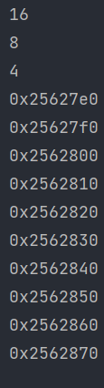

重载前内存分布如下：

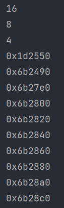

我们可以发现，已经没有内存cookie了

##### 版本2
解决了版本1中next指针浪费的问题。

```C++
/*
 *Airplane.cpp
 *Created by XingZhiang on 2021/7/13.
 *内存管理
 * version:1.2
 */
#include <iostream>

using namespace std;

class Airplane{
private:
    struct AirplaneRep{
        unsigned long miles;
        char type;
    };
private:
    union {AirplaneRep rep;
            Airplane* next;};
public:
    unsigned long getMiles(){return rep.miles;}
    char getType(){return rep.type;}
    void set(unsigned long m,char t){
        rep.miles=m;rep.type=t;
    }

public:
    static void* operator new(size_t size);
    static void operator delete(void* deadObj,size_t size);

private:
    static const int BLOCK_SIZE;
    static Airplane* headOfFreeList;
};

Airplane* Airplane::headOfFreeList = nullptr;
const int Airplane::BLOCK_SIZE = 512;  //内存池每次要512个Airplane

void *Airplane::operator new(size_t size) {
    //如果大小有误，转交给::operator new
    if(size!=sizeof(Airplane)) {return::operator new(size);}
    Airplane *p = headOfFreeList;
    if(p){headOfFreeList=p->next;}
    else {
        // free list为空，申请内存池
        Airplane *newBlock = static_cast<Airplane*>(::operator new(BLOCK_SIZE *sizeof(Airplane)));

        // 将小块穿成一个freelist
        // 但跳过#0，因为他将会被传回做本次成果
        for(int i=1;i<BLOCK_SIZE-1;i++){
            newBlock[i].next = &newBlock[i+1];
        }
        newBlock[BLOCK_SIZE-1].next= nullptr;
        p = newBlock;
        headOfFreeList = &newBlock[1];
    }
    return p;
}

// operator delete接过一块内存块，如果大小正确，就把他加到free list前端
void Airplane::operator delete(void *deadObj, size_t size){
    if(deadObj==0) return;
    if(size!=sizeof (Airplane)){
        ::operator delete(deadObj);
        return;
    }
    Airplane* carcess = static_cast<Airplane*>(deadObj);
    carcess->next=headOfFreeList;
    headOfFreeList = carcess;
}

int main(){
    cout<<sizeof(Airplane)<<endl;
    size_t const N =100;
    Airplane* p[N];
    for(int i=0;i<N;++i){
        p[i] = new Airplane;
    }
    p[1]->set(1000,'A');
    p[5]->set(2000,'B');
    p[9]->set(50000,'C');
    for(int i=0;i<10;++i){
        cout<<p[i]<<endl;
    }
    for(int i=0;i<10;++i){
        delete p[i];
    }
}
```

疑问:为什么能用union联合__ref__和__next__?

* next只在分配内存时有用，当内存分配结束，next就不再用到，可以直接用ref的值覆盖ref。

#####  版本3 static allocator 

集中管理

```C++
/*
 * Allocator.h
 * Created by XingZhiang on 2021/7/13.
 * 内存管理
 * version:1.3
 */

#ifndef SRC_ALLOCATOR_H
#define SRC_ALLOCATOR_H
class Allocator{
private:
    struct obj{
        struct obj* next;
    };
public:
    void* allocate(size_t);
    void deallocate(void*,size_t);

private:
    obj* freeStore = nullptr;
    const int CHUNK = 5; //内存块大小
};
void* Allocator::allocate(size_t size) {
    obj *p;
    if(!freeStore){
        // list为空，申请一大块空间
        size_t chunk = CHUNK *size;
        freeStore = p = (obj*)malloc(chunk);

        // 分成小块
        for(int i=0;i<(CHUNK-1);i++){
            p->next=(obj*)((char*)p + size);
            p=p->next;
        }
        p->next = nullptr;
    }
    p = freeStore;
    freeStore = freeStore->next;
    return p;
}

void Allocator::deallocate(void * p, size_t size) {
    ((obj*)p)->next = freeStore;
    freeStore = (obj*)p;
}
#endif //SRC_ALLOCATOR_H
```

```C++
/*
 * Foo.cpp
 * 测试文件
 * 测试Allocator.h
 */
#include <iostream>
#include "Allocator.h"
using namespace std;

class Foo{
public:
    long L;
    int I;
    static Allocator myAlloc;
public:
    Foo(long l):L(l){};
    static void* operator new(size_t size){
        return myAlloc.allocate(size);
    }
    static void operator delete (void* pdead,size_t size){
        return myAlloc.deallocate(pdead,size);
    }
};
Allocator Foo::myAlloc;

int main(){
    Foo* p[100];
    cout<<"sizeof(Foo)="<<sizeof(Foo)<<endl;
    for(int i=0;i<23;++i){
        p[i] = new Foo(i);
        cout<<p[i]<<" "<<p[i]->L<<endl;
    }
    for(int i=0;i<100;i++){
        delete p[i];
    }
}
```

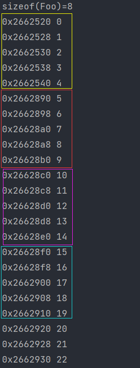

没5个一块是连续的。

######  macro for static allocator

将上述allocate代码定义为macro(宏)

```C++
/*
 * Allocator.h
 * Created by XingZhiang on 2021/7/13.
 * 内存管理
 * version:1.3.1
 */

#ifndef SRC_ALLOCATOR_H
#define SRC_ALLOCATOR_H
class Allocator{
private:
    struct obj{
        struct obj* next;
    };
public:
    void* allocate(size_t);
    void deallocate(void*,size_t);

private:
    obj* freeStore = nullptr;
    const int CHUNK = 5; //内存块大小
};
void* Allocator::allocate(size_t size) {
    obj *p;
    if(!freeStore){
        // list为空，申请一大块空间
        size_t chunk = CHUNK *size;
        freeStore = p = (obj*)malloc(chunk);

        // 分成小块
        for(int i=0;i<(CHUNK-1);i++){
            p->next=(obj*)((char*)p + size);
            p=p->next;
        }
        p->next = nullptr;
    }
    p = freeStore;
    freeStore = freeStore->next;
    return p;
}

void Allocator::deallocate(void * p, size_t size) {
    ((obj*)p)->next = freeStore;
    freeStore = (obj*)p;
}

#define DECLARE_POOL_ALLOC() \
public:                      \
    static void* operator new(size_t size){return myAlloc.allocate(size);} \
    static void operator delete (void* pdead,size_t size){return myAlloc.deallocate(pdead,size);} \
protected:                   \
    static Allocator myAlloc;

#define IMPLEMENT_POOL_ALLOC(class_name) \
    Allocator class_name::myAlloc;
#endif //SRC_ALLOCATOR_H

```

```C++
/*
 * Foo.cpp
 * 测试文件
 * 测试Allocator.h
 * version:1.3.1
 */
#include <iostream>
#include "Allocator.h"
using namespace std;

class Foo{
    DECLARE_POOL_ALLOC()
public:
    long L;
    int I;
    Foo(int i):L(i) {};

};
IMPLEMENT_POOL_ALLOC(Foo)

int main(){
    Foo* p[100];
    cout<<"sizeof(Foo)="<<sizeof(Foo)<<endl;
    for(int i=0;i<23;++i){
        p[i] = new Foo(i);
        cout<<p[i]<<" "<<p[i]->L<<endl;
    }
    for(int i=0;i<100;i++){
        delete p[i];
    }
}
```

####  new handler

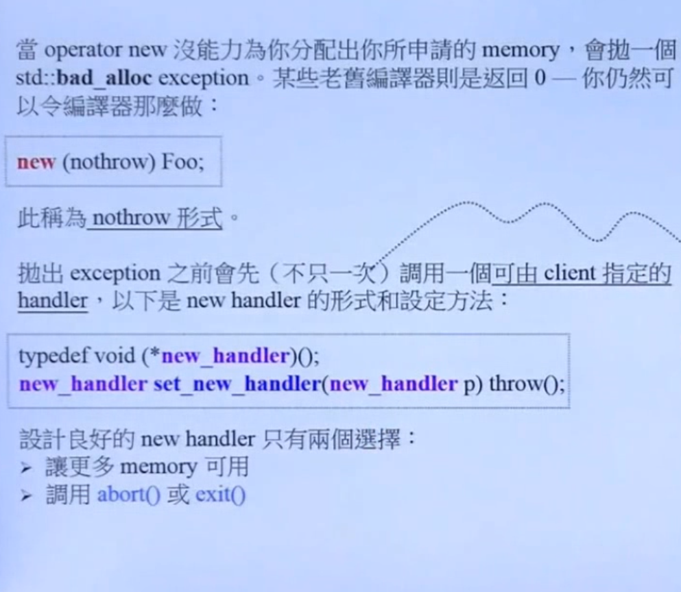

example:

```C++
#include <new>
#include <iostream>
#include <cassert>
using namespace std;

void no_more_memory(){
    cout<<"Error:out of memory"<<endl;
    abort();
}

int main(){
    set_new_handler(no_more_memory);
    int *p = new int[1000000000000000];
    assert(p);
    p = new int[100000000000000000];
    assert(p);
    delete[]p;
}
```

###  std::allocator

VC6下的malloc内存布局图

* cookie占用8个字节，小区块将造成大量浪费。由于记录区块大小。

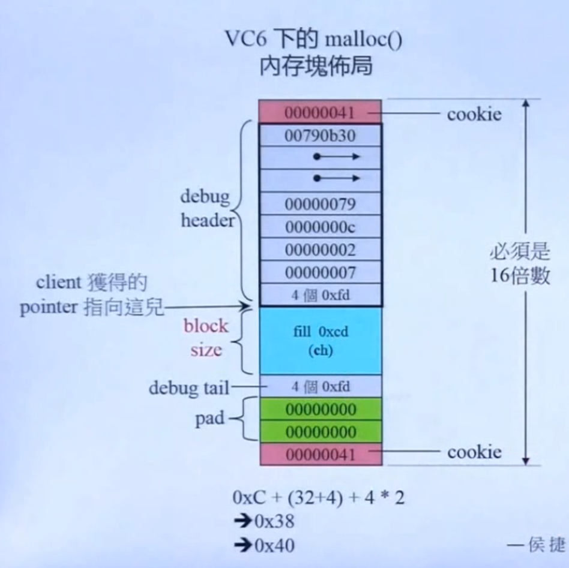

#### 旧版(gunc 2.9) alloc测试

```C++
/*
 * test for oid alloc
 */
#include <ext\pool_allocator.h>
#include <scoped_allocator>
#include <vector>
#include <iostream>

template <typename Alloc>
void cookie_test(Alloc alloc,size_t size){
    typename Alloc::value_type *p1,*p2,*p3;
    p1=alloc.allocate(size);
    p2=alloc.allocate(size);
    p3=alloc.allocate(size);

    std::cout<<"p1="<<p1<<" p2="<<p2<<" p3="<<p3<<std::endl;

    alloc.deallocate(p1,sizeof(typename Alloc::value_type));
    alloc.deallocate(p2,sizeof(typename Alloc::value_type));
    alloc.deallocate(p3,sizeof(typename Alloc::value_type));
}

int main(){
    std::cout<<sizeof(__gnu_cxx::__pool_alloc<int>)<<std::endl;
    std::vector<int,__gnu_cxx::__pool_alloc<int>> vecPool;
    cookie_test(__gnu_cxx::__pool_alloc<double>(),1);
}

/*
 *1
 *p1=0x2542800 p2=0x2542808 p3=0x2542810
 */
```

我们可以发现，分配的块内存为连续的，并没有给每一块内存上加cookie.

####  std::alloc 运行模式

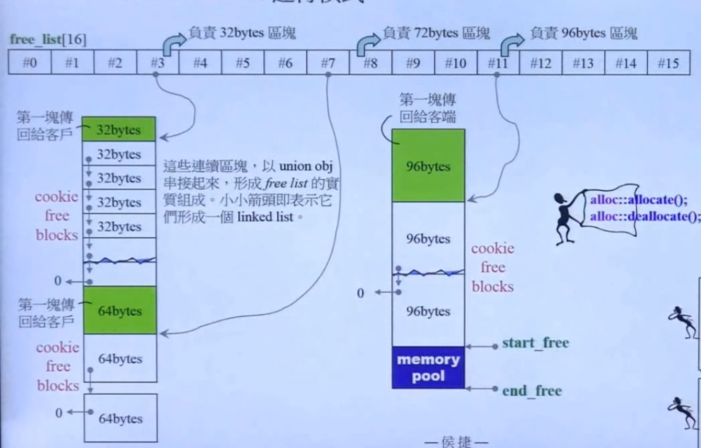

alloc有16个指针，每一个管理一条内存链。alloc每次分配size \*20 \*2大小的blocks，先将前size \*20大小blockes划分为20的小块，组成链表。

其中size为指针编号加一的8倍，比如#0指针每块为8bytes。当要分配的内存超过128bytes时，alloc就会失效，直接调用malloc( ),此时分配的内存就带cookie了。

串联链表的指针均为 __嵌入式指针__ (embedded pointer),暂时借用内存块的前4个字节。

* 运行一瞥

  下面几个图片是按顺序的，懒得打字了。

  1. 首先容器的大小32bytes

  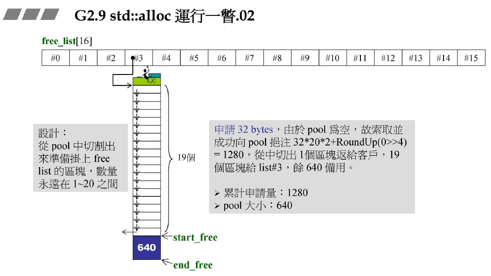

  2. 接下来申请的容器大小为64bytes，不分配内存，直接切割上述640bytes战备池(start_free和end_free之间部分)

     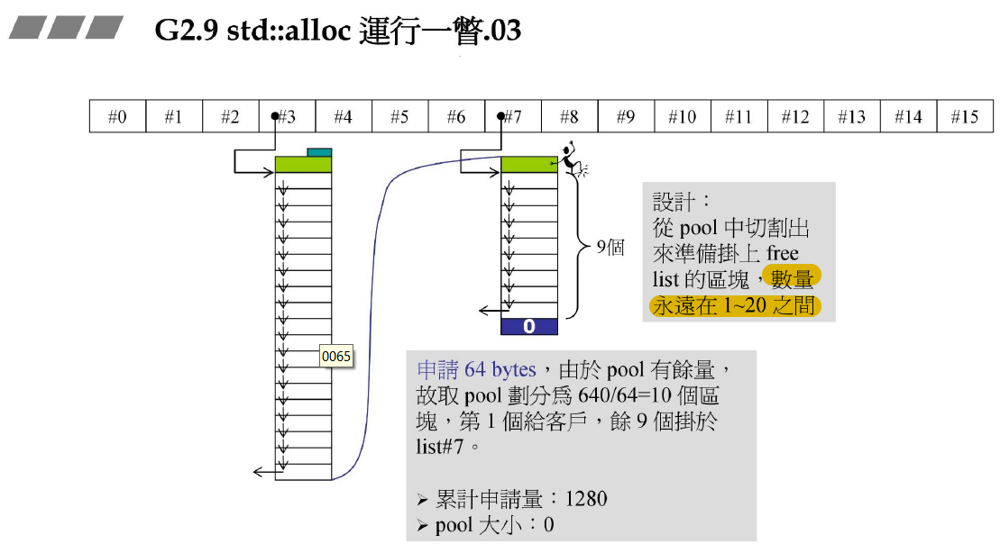

  3. 接下来申请的容器大下为96bytes，分配内存

     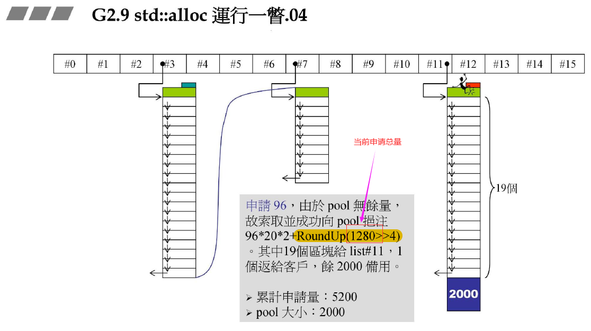

  4. 接下来申请的容器大小为88bytes，不分配内存，直接从上述2000bytes中切割

     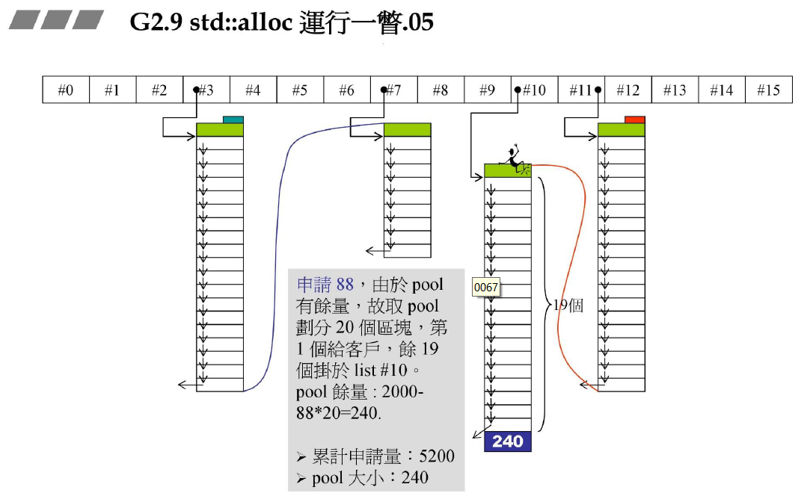

  5. 接下来进行一系列操作

     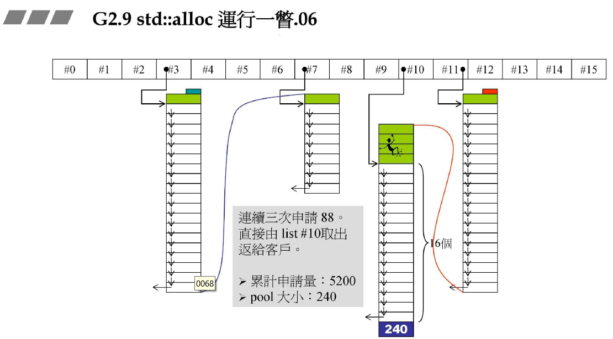

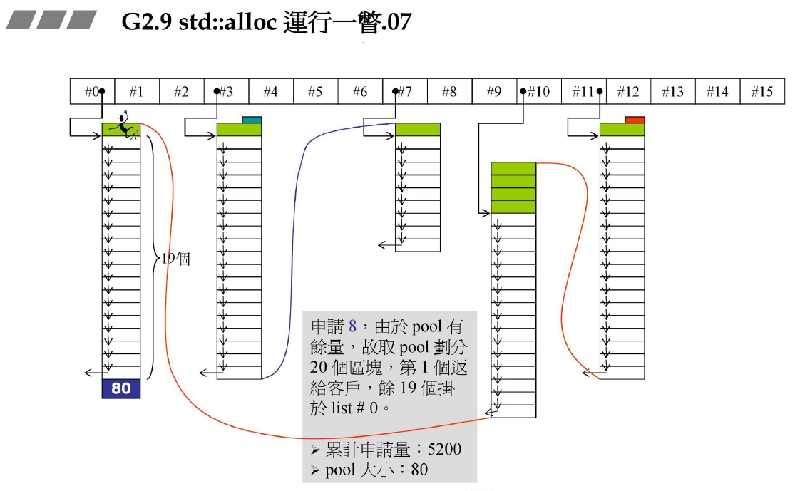

  6. 下面将产生内存碎片，将产生的碎片加到第9号链表上，之后再分配内存

     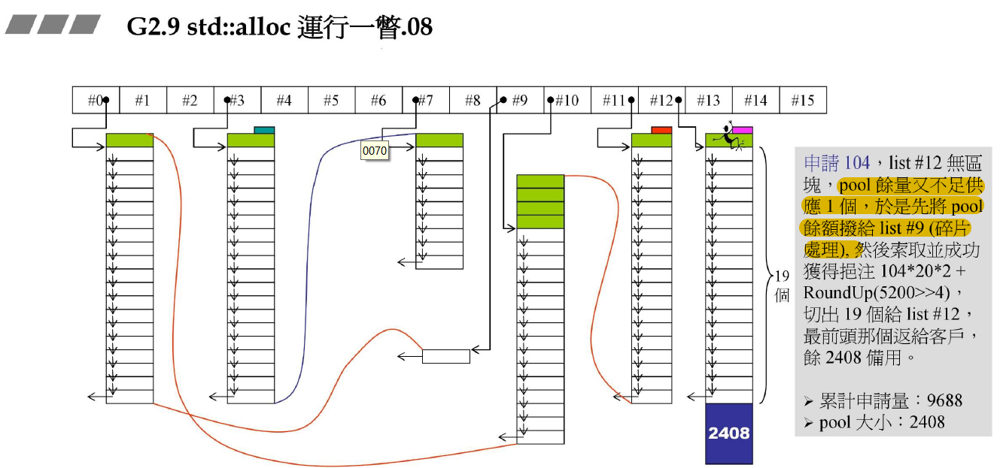

     7. 边界情况(内存不足以分配)

        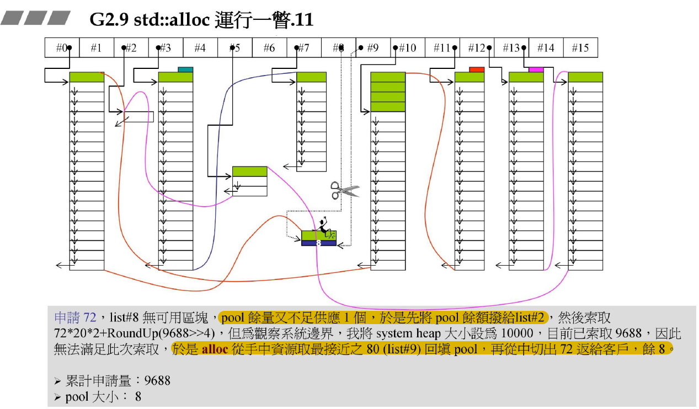

###  malloc和free

vc6.0下的malloc(贴张图上去，太复杂了，如果要深入理解，可以自己看侯捷的内存管理)

sbh(small block heap)系统

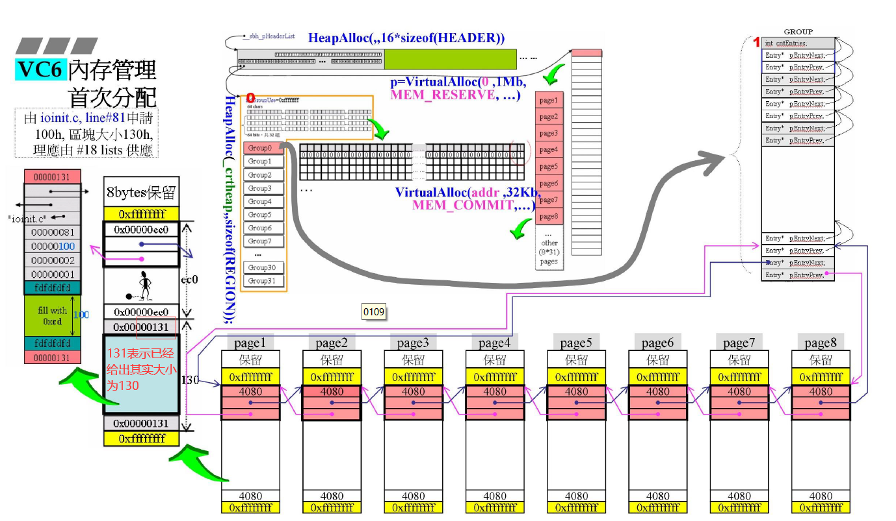

###  全局观

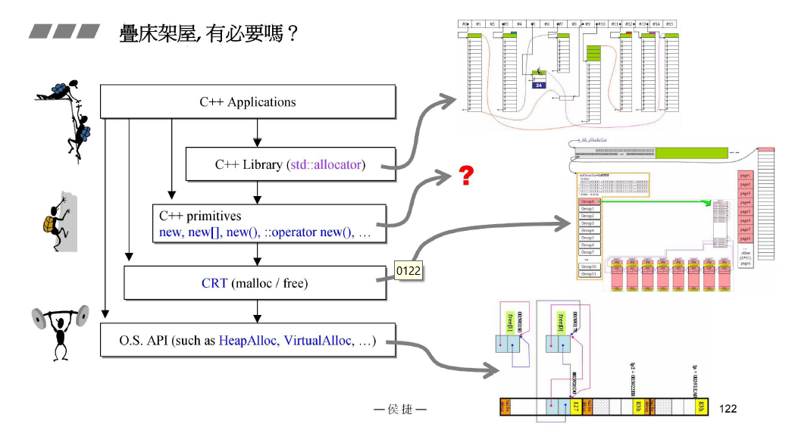

##  并发与多线程

###  基本概念

1. 并发：一个处理器同时处理多个任务。
2. 多个处理器或者是多核的处理器同时处理多个不同的任务.

> 前者是逻辑上的同时发生（simultaneous），而后者是物理上的同时发生．

3. 进程与线程

  > 进程是运行中的程序，线程是进程的内部的一个执行序列      
 >  进程是资源分配的单元，线程是执行行单元    
 >  进程间切换代价大，线程间切换代价小     
 >  进程拥有资源多，线程拥有资源少      
 >  多个线程共享进程的资源

